# Web Architecture for Concurrent LLM Querying: ChatGPT, DeepSeek, and Llama 3

[](https://www.python.org/downloads/release/python-3100/)
[](https://fastapi.tiangolo.com/)
[](https://streamlit.io/)
[](https://opensource.org/licenses/MIT)

**Bachelor's Degree in Telecommunications Systems Engineering (EETAC - UPC)**

## Introduction

This project addresses the need to streamline interactions with multiple Large Language Models (LLMs) simultaneously. The main goal is to design and build a web architecture capable of handling concurrent queries, enabling real-time technical comparison regarding latency, response quality, and resource usage, all together to raise awareness about these new technologies.

## Telematics Architecture

The following diagram illustrates the asynchronous data flow, routing strategies, and real-time telemetry extraction (TTFT, Total Latency, and Token throughput) across Edge and Cloud environments:

<p align="center">
  
</p>

## Technical Objectives

* **Asynchronous Architecture:** Implementing a backend using FastAPI and `asyncio` to minimize total wait times when executing parallel API requests (solving I/O bound bottlenecks).
* **Comparison Interface:** Developing a Streamlit frontend for visual data analysis and performance metrics in real-time.
* **LLMs Benchmarking:** Integrating both proprietary APIs (OpenAI, NVIDIA NIM) and Open Source models (DeepSeek, Llama 3 via Ollama) to evaluate their performance in corporate environments.
* **Scalability & Modularity** Designing a flexible routing architecture that allows for the seamless integration of new LLMs and third-party APIs without modifying the core asynchronous engine. 
* **Green Computing (Sustainability):** Implementing a robust caching mechanism (Memoization) to prevent redundant processing, thus analyzing and optimizing the energy efficiency associated with model inference.

## Tech Stack

* **Language:** Python 3.10+
* **Backend (Orchestrator):** FastAPI, Uvicorn, HTTPX (async streaming requests).
* **Frontend (Client):** Streamlit, Pandas.
* **Project Management:** GitHub Projects (Agile/Kanban methodology).

## Repository Structure

* `/backend`: API logic, asynchronous routers, and LLM provider integrations.
* `/frontend`: Web client code, UI components, and real-time chart visualization.
* `/docs`: Technical documentation and architecture vector diagrams.

## Getting Started (How to Run)

To evaluate this architecture locally, follow these steps:

1. **Clone the repository:**
   ```bash
   git clone [https://github.com/FR3D991/TORRES-TFG-CONCURRENT-2026.git](https://github.com/FR3D991/TORRES-TFG-CONCURRENT-2026.git)
   cd TORRES-TFG-CONCURRENT-2026

2. **Prerequisites (Local Edge Models):**
   - If you intend to benchmark the local models, you must have **Ollama** [https://ollama.com] installed on your machine. Pull the required models by running.
    ```bash
    ollama pull llama3
    ollama pull deepseek-coder
    ollama pull deepseek-llm

3. **Install dependencies:**
   ```bash
   pip install -r requirements.txt

4. **Environment Setup:**
    - Copy the example environment file and add your own API keys.
   ```bash
   cp .env.example .env

5. **Run the Backend (FastAPI):**
   cd backend
   uvicorn main:app --reload

6. **Run the Frontend (Streamlit):**
   - Open a new terminal and run.
   cd frontend
   streamlit run app.py

----
Author: Freddy Joel Torres Cabrera / Tutor: Maria Dolors Royo Vallés / Delivery Date: 08/07/2026